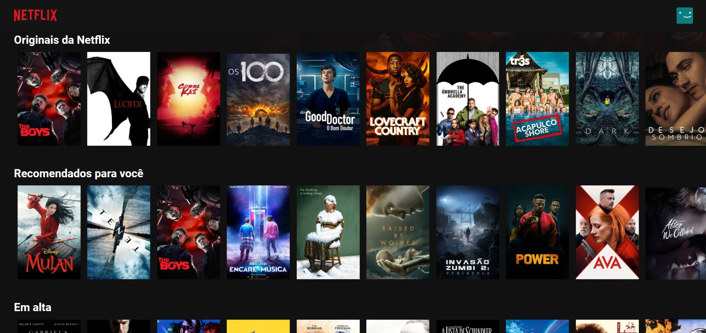

# NetflixClone

Projeto para estudo de desenvolvimento web, mais especificamente estudo de React. 

O site foi desenvolvido a partir da vídeo aula do Bonieky Lacerda no Youtube.
Acesse a vídeo aula aqui:https://www.youtube.com/watch?v=tBweoUiMsDg

Vale ressaltar que os direitos de imagem pertecem a Netflix, e os dados foram obtidos da API do site themoviedb.org

Ferramentas utilizadas:
VSCode,
JavaScript,
HTML,
CSS,
Git / GitHub.

HOME

Esta é a página inicial da aplicação.

Litas

Estas são as listas com movimento(scroll lateral).

Mobile

Esta é uma demostração da resposividade da aplicação(no caso tela do IphoneX).

